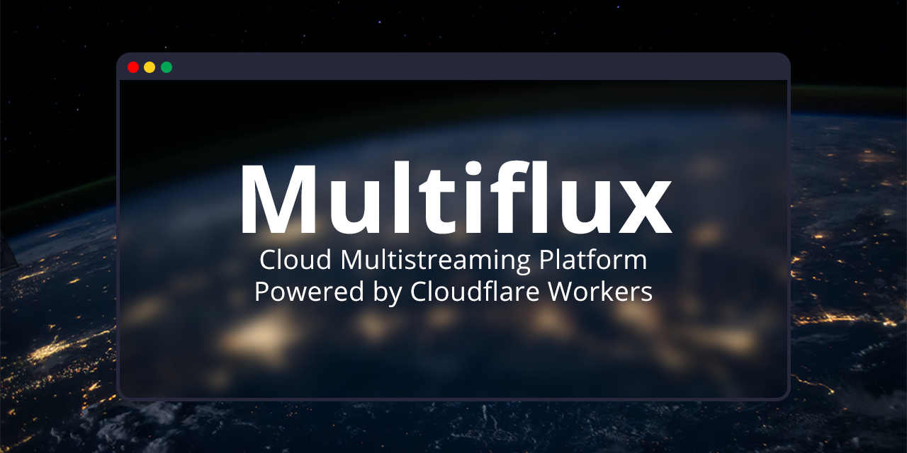

# Multiflux 🎥
Cloud Multistreaming Platform Powered by Cloudflare Workers

**Note**
This project is in development and is not yet ready for use. Many values are hardcoded and not yet configurable.

  

**Contents:**
- [Purpose](README.md#purpose)
- [Deployment](README.md#deployment)
- [How Tos](README.md#how-tos)
- [Settings and Options](README.md#settings-and-options)
- [Contributing](README.md#contributing)

## Purpose:
Multistreaming can be costly and complicated. Services such as Restream™ and Castr™ provide most of the features users need but don't give you the same flexibility, customizability, or cost savings as self deployed solutions. Other solutions do exist, such as configuring a NGINX server to redistribute incoming streams, but that requires heavy knowlege of config files and leaves much to be desired when it comes to user firendlyness.

Multiflux allows anyone to deploy the project onto their own Cloudlfare account and utilize their Workers, Pages, KV, and Stream services for as little as $5/m.

## Deployment
TODO - How to deploy (include [deploy button](https://blog.cloudflare.com/introducing-deploy-buttons/))

## How Tos

## Settings and Options
TODO - Explain various settings and options avaliable

## Contributing
This project welcomes contributions from anyone who wants to contribute to the project. See [CONTRIBUTING.md](CONTRIBUTING.md) for more information.

 Cloudflare®, *Restream®, and Castr® are trademarks of their respective organizations and not associated with this project.*
