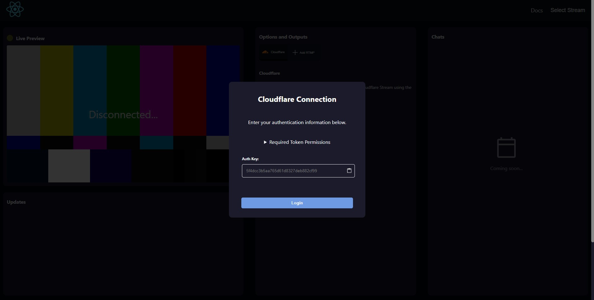
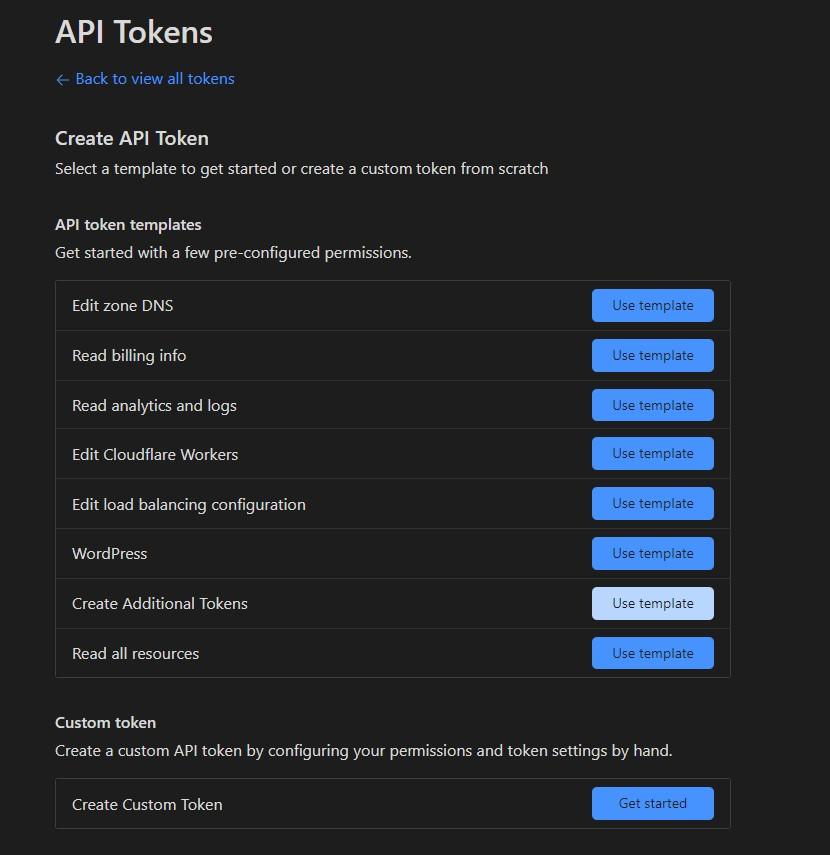
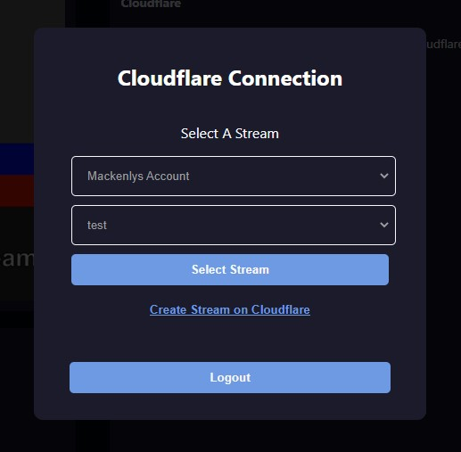
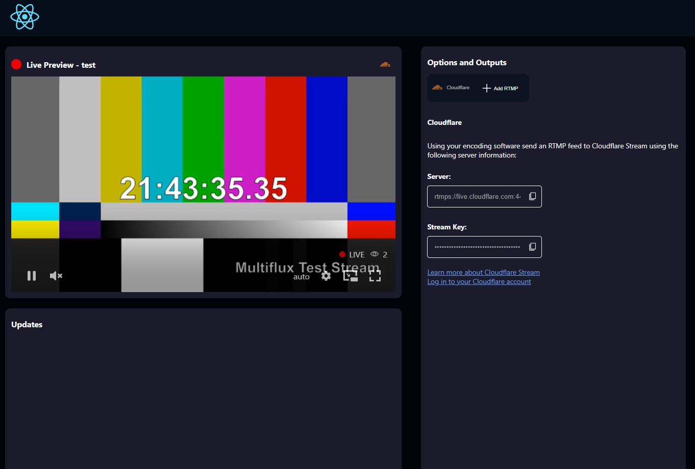
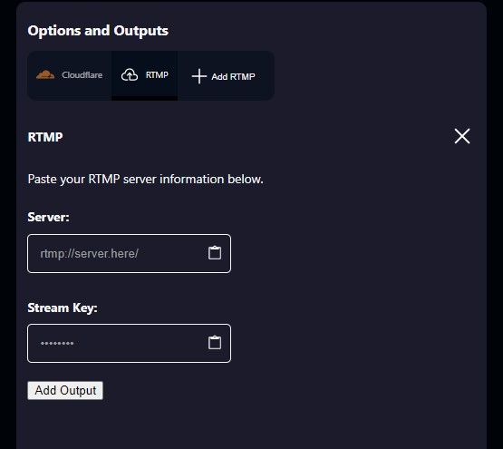
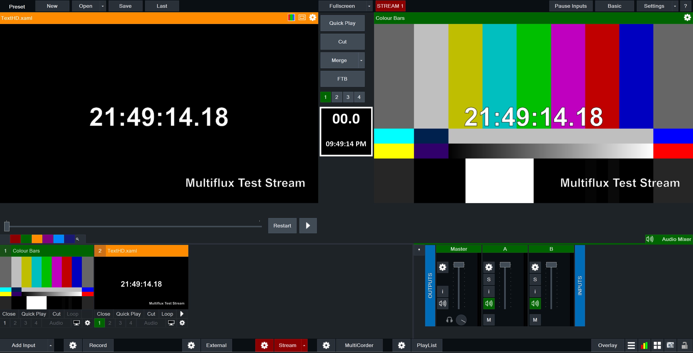

# Multiflux 🎥
Cloud Multistreaming Platform Powered by Cloudflare Workers

**Alert**
This project is in development and may be unstable/buggy. Also, you'll need an API token from your cloudflare account to use it.

This project utilizes the [Cloudflare Workers](https://www.cloudflare.com/workers/), [Cloudflare Pages](https://pages.cloudflare.com/) and [Cloudflare Stream](https://www.cloudflare.com/products/cloudflare-stream/) APIs to create a multistreaming platform that can be self hosted on the edge.

  

**Contents:**
- [Purpose](README.md#purpose)
- [Features and Roadmap](README.md#features-and-roadmap)
- [Deployment](README.md#deployment)
- [How Tos](README.md#how-tos)
- [Settings and Options](README.md#settings-and-options)
- [Contributing](README.md#contributing)

## Purpose:
Multistreaming can be costly and complicated. Services such as Restream™ and Castr™ provide most of the features users need but don't give you the same flexibility, customizability, or cost savings as self deployed solutions. Other solutions do exist, such as configuring a NGINX server to redistribute incoming streams, but that requires heavy knowlege of config files and leaves much to be desired when it comes to user firendlyness.

Multiflux allows anyone to deploy the project onto their own Cloudlfare account and utilize their Workers, Pages, KV, and Stream services for as little as $10/m.

## Features and Roadmap:
- [x] Add support for multiple stream outputs
- [ ] Add support for SRT ingest
- [ ] Add support for SRT egress
- [ ] Add support for directly egressing to social media detonations using their respective APIs
- [ ] Add support for sending meta data to social media detonations
- [ ] Show embed codes for streams
- [ ] Add support for editing stream settings
- [ ] Add chat messaging synced with Twitch, YouTube, and other services
- [ ] Add support for showing status notifications/updates regarding the stream
- [ ] Switch to a Durable Object/Websocket based architecture to reduce requests and decrease latency
- [ ] Add support for sending social media posts when a stream is live
- [ ] Add API/Webhooks for stream status changes and updating programmatically

## Deployment
Deploy by following Cloudflare's React [Framework Deployment Guide](https://developers.cloudflare.com/pages/framework-guides/deploy-a-react-application/#deploying-with-cloudflare-pages). The backend will be hosted alongside your React app's repository allowing for seamless deployment using Cloudflare's GitHub integrations.

## How Tos
When you open Multiflux you'll first see the authentication page prompting you to enter a token. This token is used to authenticate your account with Cloudflare. You can generate a token by [going to your Cloudflare account profile page](https://dash.cloudflare.com/profile/api-tokens) and clicking the "Create Token" button.

  

Select the "Read all resources" template than manually add Edit permissions for Stream.

  

After pasting your token into Multiflux you'll need to select which Cloudflare account and stream you want to use. If you don't have a stream yet, you can create one by clicking the "Create Stream on Cloudflare" button which will redirect you to your Cloudflare dashboard.

  

After selecting your stream Multiflux will load in your stream's information and attempt to display a preview if you're currently streaming. 

  

Now for the good part. To add a multistreaming output go over to the "Options and Outputs" tab and click the "Add RTMP" button. Enter your stream's key and server URL and click "Add Output". Note, Cloudflare only allows you to add server URLs that their DNSs server can reach to verify that the server is reachable.

  

Now all you have to do is start sending your stream to the RTMP info listed on the Cloudflare tab. It's that easy.

  

## Settings and Options
Currently the only settings available are the stream key and server URL for outputs. Be on the look out for more in the future. ⌚

## Contributing
This project welcomes contributions from anyone who wants to contribute to the project. See [CONTRIBUTING.md](CONTRIBUTING.md) for more information.

 Cloudflare®, *Restream®, and Castr® are trademarks of their respective organizations and not associated with this project.*
